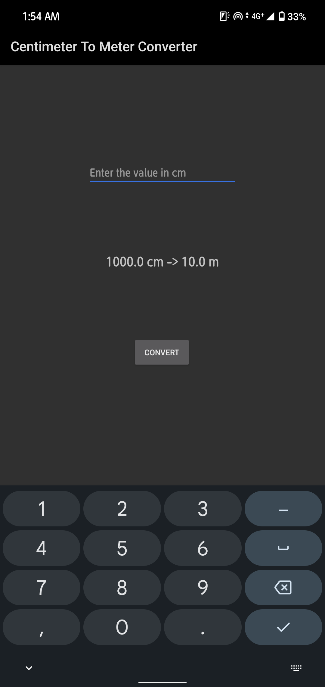
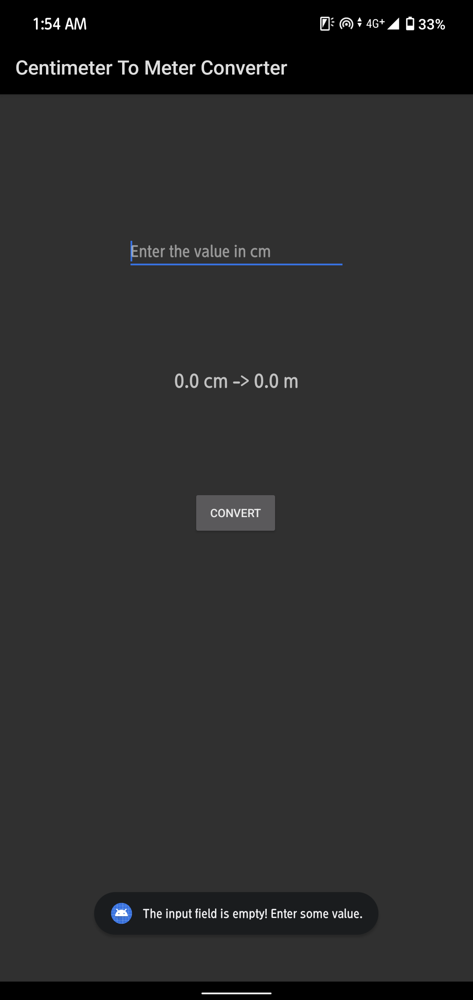

# Centimeter to Meter Converter

A simple Android application that converts centimeter values to meters with an intuitive user interface.

## 📱 Features

- **Easy Conversion**: Convert centimeters to meters with a single tap
- **Input Validation**: Prevents conversion with empty input fields
- **Clear Results**: Displays both original and converted values
- **Auto-Clear**: Input field clears automatically after conversion
- **User-Friendly Feedback**: Toast messages for error handling

## 🛠️ Technical Details

- **Language**: Kotlin
- **Minimum SDK**: Android API level (check your build.gradle)
- **Architecture**: Single Activity with traditional Android Views
- **Package Name**: `com.thepeople.centimetertometerconverter`

## 📋 How It Works

1. Enter a value in centimeters in the input field
2. Tap the "Convert" button
3. View the conversion result showing both cm and m values
4. The input field automatically clears for the next conversion

## 🏗️ App Structure

### MainActivity.kt
- Main activity handling user interactions
- Implements conversion logic (divides by 100)
- Manages UI components and user feedback

### UI Components
- **EditText**: Input field for centimeter values
- **Button**: Triggers the conversion process
- **TextView**: Displays conversion results
- **Toast**: Shows error messages for empty inputs

## 💡 Conversion Formula

```
meters = centimeters ÷ 100
```

## 🚀 Getting Started

### Prerequisites
- Android Studio
- Android SDK
- Kotlin support

### Installation
1. Clone or download the project
2. Open in Android Studio
3. Build and run on your Android device or emulator

## 📱 Usage Example

**Input**: 150  
**Output**: "150.0 cm -> 1.5 m"

## 🔧 Code Highlights

- Implements proper null safety with Kotlin
- Uses `lateinit` for view initialization
- Includes input validation to prevent crashes
- Provides clear user feedback through Toast messages

## 📂 Project Structure

```
app/
├── src/main/java/com/thepeople/centimetertometerconverter/
│   └── MainActivity.kt
├── src/main/res/layout/
│   └── main_activity.xml
└── AndroidManifest.xml
```

# Demonstration




---

**Note**: This is a learning project demonstrating basic Android development concepts including UI handling, user input validation, and simple mathematical operations.
